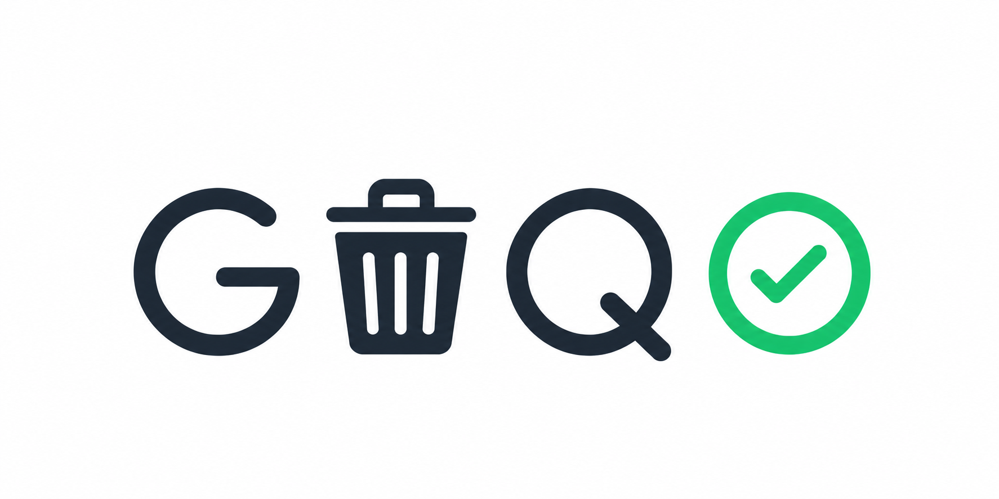
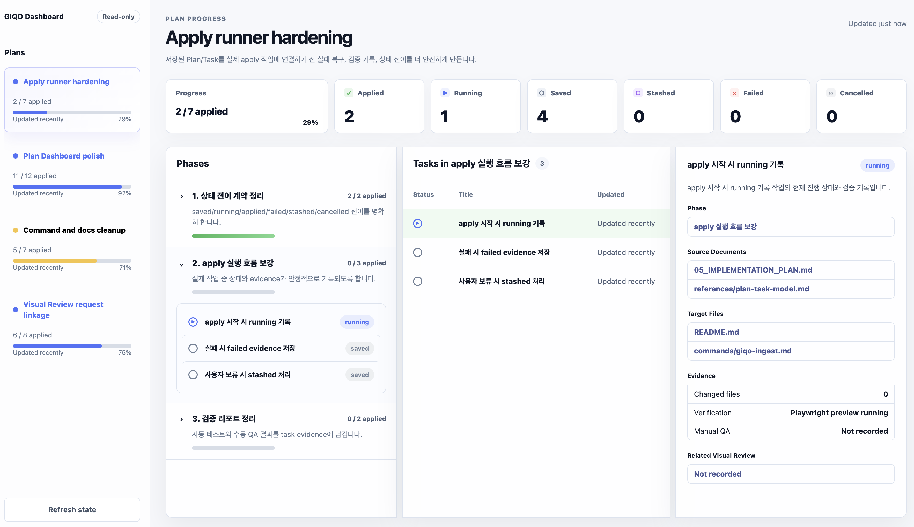

# GIQO Skill

<p align="center">
  
</p>

<p align="center">
  <strong>Garbage In, Quality Out</strong><br>
  정리되지 않은 요구사항, 이미지, 레퍼런스, 기존 프로젝트를 실제 구현 가능한 설계 문서와 작업 계획으로 바꾸는 agent skill입니다.
</p>

<p align="center">
  <a href="README.en.md"></a>
  
  
  
</p>

<p align="center">
  <a href="#핵심-워크플로우">핵심 워크플로우</a> ·
  <a href="#실제-사용-흐름">실제 사용 흐름</a> ·
  <a href="#작업-흐름-관리">작업 흐름 관리</a> ·
  <a href="#visual-review-mode">Visual Review</a> ·
  <a href="#skill-명령어와-ui에서-보이는-것">Skill 명령어</a> ·
  <a href="docs/visual-review.md">Visual Review 상세</a>
</p>

## 무엇을 해주나

GIQO는 사용자가 완성된 기획서를 준비하지 않아도, 대강 모아둔 자료에서 구현에 필요한 문서만 골라 만듭니다.

- 요구사항, 제약, 수용 기준 정리
- 부족한 정보에 대한 가정 기록
- 제품 흐름, UI/UX, 데이터 모델, API, 아키텍처 정리
- 구현 에이전트가 바로 따라갈 작업 계획 생성
- Plan/Phase/Task 단위 작업 상태와 evidence 정리
- UI 화면에서 직접 target을 선택해 수정 요청 저장

모든 문서를 무조건 만들지 않습니다. 프로젝트 성격과 입력 자료를 보고 필요한 문서만 선택합니다.

## 핵심 워크플로우

```text
rough inputs / existing repo / screenshots / review notes
→ GIQO가 입력을 분류하고 필요한 질문만 선별
→ 필요한 문서만 생성 또는 갱신
→ Plan/Phase/Task로 실제 작업 단위 구조화
→ Visual Review로 UI target에 수정 요청 저장
→ 저장된 요청과 Task를 ingest/apply 단계에서 문서와 실제 작업에 반영
```

대표 산출물은 다음 중 필요한 것만 생성됩니다.

| 문서 | 역할 |
|---|---|
| `00_INDEX.md` | 생성된 설계 패키지의 길잡이 |
| `01_REQUIREMENTS.md` | 요구사항, 제약, 수용 기준 |
| `02_ASSUMPTIONS.md` | 부족한 자료를 보완한 가정 |
| `03_PRODUCT_SPEC.md` | 사용자 목표, 범위, 워크플로우 |
| `04_ARCHITECTURE.md` | 시스템 구조와 연동 지점 |
| `05_IMPLEMENTATION_PLAN.md` | 구현 순서와 검증 기준 |
| `06_UI_UX_SPEC.md` | 화면 구조, 상태, 접근성, UI 결정 |
| `07_DATA_MODEL.md` | 엔티티, 관계, 저장소 메모 |
| `08_API_SPEC.md` | API, 명령, 외부 계약 |
| `09_RISK_AND_DECISIONS.md` | 리스크, 결정 사항, 미해결 이슈 |

## 실제 사용 흐름

### 기존 프로젝트에서 바로 시작

작업 중인 프로젝트 루트에서 자연어로 요청합니다.

```text
/giqo-skill 이 디렉토리의 기존 프로젝트를 바탕으로, 현재 구조를 유지하면서 구현 가능한 설계 문서와 작업 계획을 만들어줘.
```

GIQO는 레포 구조, 기존 코드, 문서, `.giqo/` 상태를 읽고 필요한 문서와 작업 계획만 만듭니다. 불명확한 부분은 꼭 필요한 질문만 하거나 `02_ASSUMPTIONS.md`에 가정으로 남깁니다.

### 레퍼런스나 자료가 있을 때

스크린샷, 경쟁 서비스 링크, 기획 메모, 회의록, 기존 문서를 함께 넣고 요청합니다.

```text
/giqo-skill ./input 자료랑 현재 프로젝트를 같이 보고, UI/UX 명세와 구현 계획을 업데이트해줘.
```

GIQO는 자료를 신뢰도와 관련도별로 분류하고, 충돌하는 내용은 assumptions나 risks에 남깁니다. UI가 중요하면 [Visual Review](#visual-review-mode) 화면도 만들거나 갱신합니다.

### 생짜 아이디어만 있을 때

아직 프로젝트나 자료가 거의 없어도 시작할 수 있습니다.

```text
/giqo-skill 대략 이런 서비스를 만들고 싶어: 팀원이 올린 요구사항과 스크린샷을 분석해서 바로 구현 가능한 문서로 정리해주는 도구.
불명확한 건 최소한만 물어보고, 스킵하면 합리적으로 가정해줘.
```

GIQO는 범위, 사용자, 핵심 플로우를 먼저 좁히고 필요한 문서 세트만 선택합니다. 자료가 부족한 부분은 이유와 함께 가정으로 기록합니다.

상세 정책은 [기존 프로젝트 모드](references/existing-project-mode.md), [문서 선택 기준](references/document-selection.md), [질문 정책](references/interview-policy.md)을 참고하세요.

## 작업 흐름 관리

GIQO 산출물은 구현자가 바로 따라갈 수 있도록 작업 단위를 함께 관리할 수 있습니다. 작업 흐름은 [Plan/Phase/Task 모델](references/plan-task-model.md)을 따릅니다.

| 개념 | 역할 |
|---|---|
| Plan | 하나의 구현 목표나 변경 방향. 예: `UI 컴포넌트화 테스트 계획` |
| Phase | Plan 안의 논리적 단계. 예: `UI 경계 조사`, `정적 레이아웃 컴포넌트 분리` |
| Task | 실제로 진행 상태를 갖는 작업 단위. 상태는 `saved`, `running`, `applied`, `failed`, `stashed`, `cancelled` 중 하나입니다. |

상태 파일은 `.giqo/plans/<plan-id>/plan.json`과 `tasks.json`에 저장됩니다. Plan과 Phase의 상태는 별도로 쓰지 않고 Task 상태에서 계산합니다.

### 채팅이나 터미널에서 확인

상태만 빠르게 보고 싶으면 이렇게 요청합니다.

```text
/giqo-skill 현재 Plan 상태 보여줘.
```

기본 응답은 현재 채팅이나 터미널에 바로 표시되는 요약입니다.

```text
UI 컴포넌트화 테스트 계획
1 / 6 applied · running 0 · saved 5

Phase                          Progress
─────────────────────────────────────────
UI 경계 조사                   1 / 2
정적 레이아웃 컴포넌트 분리    0 / 1
인터랙티브 보드 컴포넌트 분리  0 / 2
계획과 UI 동작 검증            0 / 1
```

Agent는 이 요약을 만들 때 read-only helper인 [`scripts/show-plan-status.mjs`](scripts/show-plan-status.mjs)를 사용할 수 있습니다. 직접 실행해야 하는 명령은 아니지만 필요하면 아래처럼 사용할 수 있습니다.

```bash
node scripts/show-plan-status.mjs --plan-id plan-ui-components --format compact
node scripts/show-plan-status.mjs --plan-id plan-ui-components --format standard
node scripts/show-plan-status.mjs --plan-id plan-ui-components --format rich --color
```

### 대시보드로 확인

브라우저에서 보고 싶을 때만 dashboard를 명시적으로 요청합니다.

```text
/giqo-skill 현재 Plan/Phase/Task 진행 상황을 읽기 전용 대시보드로 열어줘.
```

Plan Dashboard는 sidebar, summary, Phase, Task, detail panel로 상태를 보여주는 읽기 전용 화면입니다. 상태는 dashboard에서 직접 수정하지 않고 `/giqo-skill plan`, `/giqo-skill ingest`, `/giqo-skill apply` 흐름으로만 갱신합니다.



Dashboard 파일을 만들 때는 [`scripts/generate-plan-dashboard.mjs`](scripts/generate-plan-dashboard.mjs)를 사용합니다. 이 스크립트는 현재 Plan/Task 상태를 `dashboard.html`에 포함하고 [`templates/plan-dashboard/`](templates/plan-dashboard/)의 CSS/JS를 함께 복사합니다.

상태 표시와 dashboard 생성 정책은 [Command Policy](references/command-policy.md#status-display-policy)를 참고하세요.

### 저장된 UI 수정 요청을 적용할 때

Visual Review에서 요청을 저장한 뒤에는 이렇게 말합니다.

```text
/giqo-skill .giqo에 저장된 UI 수정 요청 확인하고 적용 가능한 작업 진행해줘.
```

GIQO는 저장된 요청과 Task를 읽고 `saved → running → applied/failed` 흐름으로 상태를 갱신하면서 문서나 실제 UI 작업에 반영합니다.

Visual Review 요청과 Task 연결 방식은 [UI edit mode](references/ui-edit-mode.md)와 [`scripts/link-review-requests.mjs`](scripts/link-review-requests.mjs)를 참고하세요.

## Visual Review Mode

Visual Review는 UI 작업 중 실제 화면이나 생성된 목업에서 컴포넌트/영역을 선택하고, Claude Design처럼 해당 target에 수정 요청을 남기게 해주는 모드입니다.


사용자는 Node 명령을 직접 외울 필요 없이 프롬프트로 요청합니다.

```text
/giqo-skill 현재 화면 기준으로 UI 수정 모드 열어줘.
```

```text
/giqo-skill http://localhost:3000 화면을 Visual Review로 열고, 저장된 수정 요청을 받을 수 있게 해줘.
```

화면에서 보이는 핵심 컨트롤:

- `Status`: 저장된 요청을 `saved`, `running`, `applied`, `failed`로 필터링합니다.
- `Target`: 수정 요청을 붙일 UI 대상입니다.
- `Refresh`: agent가 갱신한 저장 상태를 다시 불러옵니다.
- `Hide feedback` / `Show feedback`: 저장된 요청 패널을 접거나 펼칩니다.
- 저장된 요청 카드의 `Edit` / `Delete`: 이미 저장한 요청을 수정하거나 삭제합니다.

브라우저는 소스 코드를 직접 바꾸지 않습니다. 저장된 요청을 실제로 반영하려면 다시 agent에게 요청합니다.

```text
/giqo-skill 방금 저장한 UI 수정 요청 적용해줘.
```

간단한 용어:

| 용어 | 의미 |
|---|---|
| Target | 수정 요청이 붙는 안정적인 UI ID. 예: `home.hero.primary-cta` |
| `saved` | 저장됨, 아직 처리 전 |
| `running` | agent가 처리 중 |
| `applied` | 문서, 아티팩트, 또는 소스에 반영됨 |
| `failed` | 적용 불가, 보류, 거절, 실패 |

상세한 저장 파일, iframe live shell, proxy, target mapping 방식은 [Visual Review 상세 문서](docs/visual-review.md)를 참고하세요.

## Skill 명령어와 UI에서 보이는 것

OpenCode 같은 환경에서는 이 스킬이 보통 `/giqo-skill` native command로 노출됩니다. GIQO가 기대하는 표준 동작 단위는 아래와 같습니다.

| 요청 예시 | 역할 | 사용자가 보는 결과 |
|---|---|---|
| `/giqo-skill init` | `.giqo/` 작업 공간 생성/갱신 | 현재 프로젝트 상태와 저장 위치 안내 |
| `/giqo-skill plan` | 입력 자료 분석 후 필요한 문서 생성 | 선택된 문서 목록, 질문, 가정, 작업 계획 |
| `/giqo-skill ui` | UI 문서, Visual Review, Plan Dashboard 생성/갱신 | 리뷰 가능한 화면, 실제 화면 연결, 또는 dashboard 안내 |
| `/giqo-skill ingest` | 저장된 코멘트/수정 요청/자료 반영 | 갱신된 문서와 남은 질문 |
| `/giqo-skill apply` | 승인된 계획, Task, 저장된 UI 요청 적용 | 진행 상태와 적용/실패 결과 |

하위 단어를 정확히 몰라도 됩니다. `/giqo-skill` 뒤에 자연어로 요청하면 GIQO가 가까운 흐름으로 해석합니다.

Agent는 구조화된 Plan/Phase/Task 입력을 실제 상태 파일로 쓸 때 `scripts/update-plan-state.mjs`를 사용합니다. 이 스크립트는 `.giqo/plans/<plan-id>/plan.json`과 `tasks.json`만 생성/갱신하며 애플리케이션 소스는 수정하지 않습니다.

Visual Review에서 저장한 UI 요청을 Task와 연결할 때는 `scripts/link-review-requests.mjs`를 사용합니다. 이 스크립트는 Task의 `sourceReviewRequests`와 요청의 `linkedTask`만 연결하며, 요청을 적용 완료로 표시하거나 소스 코드를 수정하지 않습니다.

실제 Visual Review 브라우저 UI에는 `Status`, `Target`, `Refresh`, `Hide/Show feedback`, 저장 요청의 `Edit/Delete`만 노출됩니다. 내부 저장 파일, iframe proxy, Node launcher 실행 방식은 사용자가 직접 다루지 않아도 됩니다.

Plan Dashboard는 읽기 전용입니다. Task 상태를 바꿔야 할 때는 agent가 Plan/Task 상태를 읽고 필요한 조치를 제안한 뒤 사용자의 확인을 받아 갱신합니다.

## 기존 프로젝트에서의 원칙

- `.giqo/`를 작업 공간으로 사용해 입력, 실행 기록, UI 리뷰 상태를 보관합니다.
- `.giqo/plans/`를 사용해 Plan/Phase/Task 상태와 dashboard 산출물을 보관합니다.
- 명시적인 apply 단계 전에는 애플리케이션 소스 파일을 건드리지 않습니다.
- 저장된 UI 요청이 없으면 억지로 진행하지 않고 현재 상태를 알려줍니다.
- 구현자가 무엇을 만들고, 무엇을 제외하고, 어디서 시작해야 하는지 알 수 있어야 완료입니다.

## 설치와 연결

GIQO는 별도 빌드가 필요한 패키지가 아니라 agent가 읽는 skill 폴더입니다.

```bash
git clone <repo-url> GIQO-skill
cd GIQO-skill
```

사용 중인 환경에서 `SKILL.md`, `commands/`, `references/`, `templates/`를 함께 읽을 수 있게 연결하세요.

| 환경 | 권장 방식 |
|---|---|
| Claude / Claude Code | skill 디렉터리로 `GIQO-skill/` 등록 |
| Codex | 작업 레포 옆이나 공용 skills 폴더에 배치 |
| OpenCode | skills 경로에 두거나 이 저장소를 세션에서 열기 |
| 기타 agent | `SKILL.md`를 시작 지침으로 읽고 상대 경로 유지 |

## 저장소 구조

```text
GIQO-skill/
├── SKILL.md
├── README.md
├── README.en.md
├── commands/
├── scripts/
├── references/
├── templates/
│   ├── plan-dashboard/
│   └── state/
└── git-readme/
```
